# Kế hoạch Triển khai Frontend — ApartAWS

## Tổng quan & Bối cảnh

Dự án ApartAWS là hệ thống **Đặt phòng & Quản lý căn hộ** triển khai trên nền tảng Cloud-Native AWS, với kiến trúc microservices:

```mermaid
graph LR
    FE["web-portal<br/>(React + Vite)"]
    GW["api-gateway<br/>(NestJS :3000)"]
    AUTH["auth-service<br/>(:3001)"]
    APT["apartment-service<br/>(:3002)"]
    BOOK["booking-service<br/>(:3003)"]
    DB[(PostgreSQL)]

    FE -->|/api/*| GW
    GW --> AUTH
    GW --> APT
    GW --> BOOK
    AUTH --> DB
    APT --> DB
    BOOK --> DB
```



### Hiện trạng Frontend

| Module | Trạng thái | Chi tiết |
|--------|-----------|----------|
| `auth` | ✅ Hoàn thành | Login, Register, Forgot Password đã có UI + service |
| `portal` | ⬜ Trống | Thư mục `components/`, `pages/`, `services/`, `hooks/`, `constants/` đều rỗng |
| `admin` | ⬜ Trống | Tương tự portal |

### Backend APIs có sẵn

**Apartment Service** (`/api/Apartments`):
| Method | Endpoint | Mô tả | Auth |
|--------|----------|-------|------|
| `GET` | `/Apartments` | Danh sách tất cả (admin) | ✅ |
| `GET` | `/Apartments/listing` | Danh sách active (public) | ❌ |
| `GET` | `/Apartments/:id` | Chi tiết căn hộ | ❌ |
| `POST` | `/Apartments` | Tạo căn hộ mới | ✅ (Owner) |
| `PUT` | `/Apartments/:id` | Cập nhật căn hộ | ✅ (Owner) |
| `DELETE` | `/Apartments/:id` | Xoá căn hộ | ✅ (Owner) |

**Booking Service** (`/api/Bookings`):
| Method | Endpoint | Mô tả | Auth |
|--------|----------|-------|------|
| `POST` | `/Bookings` | Tạo đơn đặt phòng | ✅ (Tenant) |
| `GET` | `/Bookings/my-bookings` | Lịch sử đặt phòng của tôi | ✅ (Tenant) |
| `GET` | `/Bookings/owner` | Booking của căn hộ mình sở hữu | ✅ (Owner) |
| `GET` | `/Bookings/check-availability` | Kiểm tra lịch trống | ❌ |
| `GET` | `/Bookings/:id` | Chi tiết booking | ✅ |
| `PATCH` | `/Bookings/:id/cancel` | Huỷ booking | ✅ |

### Tech Stack Frontend hiện tại

- **Framework**: React 19 + Vite 7 + TypeScript
- **UI Library**: Ant Design 6 + styled-components
- **Routing**: TanStack Router
- **Data Fetching**: TanStack React Query + Axios
- **State**: Redux Toolkit (đã cài nhưng chưa dùng)
- **Auth**: Token-based (access + refresh) qua `tokenManager`

---

## User Review Required

> [!IMPORTANT]
> **UI Mockup chưa có**: Bạn đề cập sẽ gửi mẫu UI sau. Kế hoạch dưới đây sẽ xây dựng **cấu trúc code, service layer, routing, và logic nghiệp vụ** theo pattern hiện có trong project. Khi có mockup, tôi sẽ áp dụng UI chính xác lên các page component.

> [!WARNING]
> **Presigned URL cho S3**: Backend hiện **chưa có endpoint** tạo presigned URL. Ở Phase 3 (Ngày 11-13), tôi sẽ cần bổ sung endpoint trên `apartment-service` hoặc tạo một service riêng. Bạn muốn approach nào?

> [!IMPORTANT]
> **Cấu trúc module Portal vs Admin**: Hiện tại project có 3 module FE: `auth`, `portal`, `admin`.
> - **Portal** = giao diện dành cho User (Tenant) — xem căn hộ, đặt phòng, xem lịch sử
> - **Admin** = giao diện dành cho Owner/Admin — đăng tin căn hộ, quản lý
>
> Xác nhận: Mapping này có đúng ý bạn không?

---

## Proposed Changes

### Phase 1 — Ngày 6-7: Dashboard & Danh sách căn hộ

#### Mục tiêu
- Trang Dashboard tổng quan (thống kê cơ bản)
- Trang danh sách căn hộ public (listing) với tìm kiếm + phân trang
- Thiết lập **Service Layer** cho Apartment

---

#### Portal Service Layer (Apartment)

##### [NEW] [types.ts](file:///home/dtc/ws/APARTAWS/apps/web-portal/src/apps/portal/services/types.ts)
Định nghĩa TypeScript interfaces khớp với Prisma schema:
```typescript
// IApartment — khớp với model Apartment trong apartment-service
interface IApartment {
  id: string;
  title: string;
  description?: string;
  pricePerNight: number;
  location: string;
  amenities: string[];
  images: string[];
  isActive: boolean;
  ownerId?: string;
  createdAt: string;
  updatedAt: string;
}

// IBooking — khớp với model Booking trong booking-service
interface IBooking { ... }

// Query params
interface IApartmentQuery { Keyword?: string; Page?: number; PageSize?: number; }
```

##### [NEW] [api.ts](file:///home/dtc/ws/APARTAWS/apps/web-portal/src/apps/portal/services/api.ts)
API functions theo pattern của auth service, sử dụng `axiosClient`:
- `getApartmentListing(params)` → `GET /Apartments/listing`
- `getApartmentById(id)` → `GET /Apartments/:id`
- `checkAvailability(params)` → `GET /Bookings/check-availability`
- `createBooking(payload)` → `POST /Bookings`
- `getMyBookings(params)` → `GET /Bookings/my-bookings`
- `cancelBooking(id)` → `PATCH /Bookings/:id/cancel`
- `getBookingById(id)` → `GET /Bookings/:id`

##### [NEW] [query.ts](file:///home/dtc/ws/APARTAWS/apps/web-portal/src/apps/portal/services/query.ts)
React Query hooks cho GET requests:
- `useApartmentListing(params)` → queryKey: `['apartments', 'listing', params]`
- `useApartmentDetail(id)` → queryKey: `['apartments', id]`
- `useMyBookings(params)` → queryKey: `['bookings', 'my', params]`
- `useCheckAvailability(params)` → queryKey: `['bookings', 'availability', params]`
- `useBookingDetail(id)` → queryKey: `['bookings', id]`

##### [NEW] [mutation.ts](file:///home/dtc/ws/APARTAWS/apps/web-portal/src/apps/portal/services/mutation.ts)
React Query hooks cho POST/PATCH/DELETE:
- `useCreateBooking()`
- `useCancelBooking()`

##### [NEW] [index.ts](file:///home/dtc/ws/APARTAWS/apps/web-portal/src/apps/portal/services/index.ts)
Re-export tất cả hooks

---

#### Portal Routing & Layout

##### [NEW] [Route.tsx](file:///home/dtc/ws/APARTAWS/apps/web-portal/src/apps/portal/Route.tsx)
Thiết lập route tree cho portal module:
```
/                    → Dashboard (redirect hoặc landing)
/can-ho              → Danh sách căn hộ
/can-ho/:id          → Chi tiết căn hộ
/dat-phong/:id       → Form đặt phòng
/lich-su-dat-phong   → Lịch sử đặt phòng của tôi
/lich-su-dat-phong/:id → Chi tiết booking
```

##### [NEW] [PortalLayout.tsx](file:///home/dtc/ws/APARTAWS/apps/web-portal/src/apps/portal/components/PortalLayout.tsx)
Layout wrapper cho portal module: Header + Sidebar + Content area (sử dụng shared components `header/`, `sidebar/`)

##### [MODIFY] [Route.tsx](file:///home/dtc/ws/APARTAWS/apps/web-portal/src/Route.tsx)
Thêm `portalRoute` vào `routeTree` (bỏ comment các route cũ, thêm portal)

---

#### Portal Pages — Dashboard

##### [NEW] [Dashboard.tsx](file:///home/dtc/ws/APARTAWS/apps/web-portal/src/apps/portal/pages/dashboard/Dashboard.tsx)
Trang tổng quan bao gồm:
- Thống kê nhanh (cards): Tổng căn hộ, Booking đang chờ, Booking hoàn thành
- Chart đơn giản (sử dụng `react-chartjs-2` đã cài) — biểu đồ booking theo tháng
- Danh sách căn hộ mới nhất (top 5)

##### [NEW] [Route.tsx](file:///home/dtc/ws/APARTAWS/apps/web-portal/src/apps/portal/pages/dashboard/Route.tsx)
Route definition cho Dashboard page

---

#### Portal Pages — Danh sách căn hộ

##### [NEW] [ApartmentList.tsx](file:///home/dtc/ws/APARTAWS/apps/web-portal/src/apps/portal/pages/apartment-list/ApartmentList.tsx)
Trang listing căn hộ:
- Search bar (keyword)
- Grid/Card view hiển thị căn hộ (ảnh, tên, giá, vị trí, tiện ích)
- Pagination (sử dụng Ant Design Pagination)
- Click vào card → navigate đến chi tiết

##### [NEW] [ApartmentCard.tsx](file:///home/dtc/ws/APARTAWS/apps/web-portal/src/apps/portal/components/ApartmentCard.tsx)
Component card hiển thị 1 căn hộ trong listing

##### [NEW] [Route.tsx](file:///home/dtc/ws/APARTAWS/apps/web-portal/src/apps/portal/pages/apartment-list/Route.tsx)
Route definition

---

#### Portal Constants

##### [NEW] [index.ts](file:///home/dtc/ws/APARTAWS/apps/web-portal/src/apps/portal/constants/index.ts)
Hằng số route:
```typescript
export const DASHBOARD_ROUTE = '/';
export const APARTMENT_LIST_ROUTE = '/can-ho';
export const APARTMENT_DETAIL_ROUTE = '/can-ho/$id';
export const BOOKING_FORM_ROUTE = '/dat-phong/$id';
export const MY_BOOKINGS_ROUTE = '/lich-su-dat-phong';
export const BOOKING_DETAIL_ROUTE = '/lich-su-dat-phong/$id';
```

---

### ✅ Phase 2 — Ngày 8-10: Luồng Đặt phòng (Booking)

#### Mục tiêu
- Trang chi tiết căn hộ (gallery ảnh, thông tin, nút đặt phòng)
- Form đặt phòng (chọn ngày, tính giá, kiểm tra availability)
- Trang lịch sử đặt phòng + chi tiết booking

---

#### Portal Pages — Chi tiết căn hộ

##### [NEW] [ApartmentDetail.tsx](file:///home/dtc/ws/APARTAWS/apps/web-portal/src/apps/portal/pages/apartment-detail/ApartmentDetail.tsx)
Trang chi tiết căn hộ:
- Image gallery/carousel (Ant Design Carousel)
- Thông tin: title, description, pricePerNight, location
- Danh sách amenities (tags)
- Nút "Đặt phòng ngay" → navigate đến form booking
- Widget kiểm tra ngày trống (gọi `check-availability`)

##### [NEW] [Route.tsx](file:///home/dtc/ws/APARTAWS/apps/web-portal/src/apps/portal/pages/apartment-detail/Route.tsx)
Route definition với param `$id`

---

#### Portal Pages — Form Đặt phòng

##### [NEW] [BookingForm.tsx](file:///home/dtc/ws/APARTAWS/apps/web-portal/src/apps/portal/pages/booking-form/BookingForm.tsx)
Form đặt phòng:
- Hiển thị tóm tắt căn hộ (fetch từ `getApartmentById`)
- Date picker: chọn startDate, endDate (Ant Design DatePicker.RangePicker)
- Tự động tính `totalPrice` = số đêm × pricePerNight
- Nút kiểm tra availability trước khi submit
- Call `POST /Bookings` khi submit
- Redirect đến trang chi tiết booking sau khi tạo thành công

##### [NEW] [Route.tsx](file:///home/dtc/ws/APARTAWS/apps/web-portal/src/apps/portal/pages/booking-form/Route.tsx)
Route definition với param `$id` (apartmentId)

---

#### Portal Pages — Lịch sử Đặt phòng

##### [NEW] [MyBookings.tsx](file:///home/dtc/ws/APARTAWS/apps/web-portal/src/apps/portal/pages/my-bookings/MyBookings.tsx)
Trang lịch sử đặt phòng:
- Ant Design Table hiển thị danh sách bookings
- Columns: Tên căn hộ, Ngày check-in, Ngày check-out, Tổng tiền, Trạng thái, Hành động
- Trạng thái: PENDING (vàng), CONFIRMED (xanh), CANCELLED (đỏ), COMPLETED (xám)
- Hành động: Xem chi tiết, Huỷ booking (chỉ khi PENDING)
- Search + phân trang

##### [NEW] [BookingDetail.tsx](file:///home/dtc/ws/APARTAWS/apps/web-portal/src/apps/portal/pages/my-bookings/BookingDetail.tsx)
Chi tiết 1 booking:
- Thông tin căn hộ (enriched từ BE)
- Timeline trạng thái booking
- Nút huỷ (nếu PENDING/CONFIRMED)

##### [NEW] [Route.tsx](file:///home/dtc/ws/APARTAWS/apps/web-portal/src/apps/portal/pages/my-bookings/Route.tsx)
Route definition

---

#### Portal Hooks

##### [NEW] [useBookingCalculation.ts](file:///home/dtc/ws/APARTAWS/apps/web-portal/src/apps/portal/hooks/useBookingCalculation.ts)
Hook tính toán:
- Tính số đêm từ startDate → endDate
- Tính totalPrice = nights × pricePerNight
- Format currency VND

---

### ✅ Phase 3 — Ngày 11-13: Chức năng Chủ nhà (Owner)

#### Mục tiêu
- Form đăng tin căn hộ (CRUD) với upload ảnh lên S3 qua Presigned URL
- Quản lý danh sách căn hộ đã đăng
- Xem booking của căn hộ mình sở hữu

---

#### Admin Service Layer

##### [NEW] [types.ts](file:///home/dtc/ws/APARTAWS/apps/web-portal/src/apps/admin/services/types.ts)
Types riêng cho admin/owner:
```typescript
interface ICreateApartmentPayload {
  title: string;
  description?: string;
  pricePerNight: number;
  location: string;
  amenities: string[];
  images: string[];
  isActive?: boolean;
}

interface IPresignedUrlResponse {
  uploadUrl: string;
  fileKey: string;
  publicUrl: string;
}
```

##### [NEW] [api.ts](file:///home/dtc/ws/APARTAWS/apps/web-portal/src/apps/admin/services/api.ts)
API functions cho Owner:
- `getMyApartments(params)` → `GET /Apartments` (filter by ownerId qua header)
- `createApartment(payload)` → `POST /Apartments`
- `updateApartment(id, payload)` → `PUT /Apartments/:id`
- `deleteApartment(id)` → `DELETE /Apartments/:id`
- `getOwnerBookings(params)` → `GET /Bookings/owner`
- `getPresignedUrl(fileName)` → **Cần bổ sung endpoint BE** hoặc mock
- `uploadToS3(presignedUrl, file)` → Direct upload bằng `axios.put()`

##### [NEW] [query.ts](file:///home/dtc/ws/APARTAWS/apps/web-portal/src/apps/admin/services/query.ts)
- `useMyApartments(params)`
- `useOwnerBookings(params)`

##### [NEW] [mutation.ts](file:///home/dtc/ws/APARTAWS/apps/web-portal/src/apps/admin/services/mutation.ts)
- `useCreateApartment()`
- `useUpdateApartment()`
- `useDeleteApartment()`

##### [NEW] [index.ts](file:///home/dtc/ws/APARTAWS/apps/web-portal/src/apps/admin/services/index.ts)

---

#### Admin Routing & Layout

##### [NEW] [Route.tsx](file:///home/dtc/ws/APARTAWS/apps/web-portal/src/apps/admin/Route.tsx) _(nếu chưa có)_
Route tree cho admin/owner module:
```
/quan-ly                → Dashboard Owner
/quan-ly/can-ho         → Danh sách căn hộ của tôi
/quan-ly/can-ho/tao-moi → Form tạo mới
/quan-ly/can-ho/:id     → Form chỉnh sửa
/quan-ly/booking        → Booking của căn hộ mình
```

##### [NEW] [AdminLayout.tsx](file:///home/dtc/ws/APARTAWS/apps/web-portal/src/apps/admin/components/AdminLayout.tsx)
Layout wrapper khác portal (sidebar menu cho owner)

##### [MODIFY] [Route.tsx](file:///home/dtc/ws/APARTAWS/apps/web-portal/src/Route.tsx)
Thêm `adminRoute` vào `routeTree`

---

#### Admin Pages — Quản lý Căn hộ

##### [NEW] [MyApartments.tsx](file:///home/dtc/ws/APARTAWS/apps/web-portal/src/apps/admin/pages/my-apartments/MyApartments.tsx)
Trang quản lý căn hộ đã đăng:
- Ant Design Table: title, location, price, trạng thái active, actions
- Actions: Sửa, Xoá (confirm), Toggle Active
- Nút "Đăng tin mới"

##### [NEW] [ApartmentForm.tsx](file:///home/dtc/ws/APARTAWS/apps/web-portal/src/apps/admin/pages/apartment-form/ApartmentForm.tsx)
Form tạo/chỉnh sửa căn hộ (dùng chung cho Create & Edit):
- **Ant Design Form** với validation
- Fields: title, description (TextArea), pricePerNight (InputNumber), location, amenities (Select tags)
- **Upload ảnh** (Ant Design Upload component):
  1. User chọn file → FE gọi API lấy Presigned URL
  2. FE upload trực tiếp file lên S3 bằng `PUT presignedUrl`
  3. Lưu `publicUrl` vào mảng `images[]`
  4. Submit form → `POST /Apartments` hoặc `PUT /Apartments/:id`

##### [NEW] [Route.tsx](file:///home/dtc/ws/APARTAWS/apps/web-portal/src/apps/admin/pages/my-apartments/Route.tsx)
##### [NEW] [Route.tsx](file:///home/dtc/ws/APARTAWS/apps/web-portal/src/apps/admin/pages/apartment-form/Route.tsx)

---

#### Admin Pages — Booking của Owner

##### [NEW] [OwnerBookings.tsx](file:///home/dtc/ws/APARTAWS/apps/web-portal/src/apps/admin/pages/owner-bookings/OwnerBookings.tsx)
Trang xem booking của các căn hộ mình sở hữu:
- Table: Tên căn hộ, Khách thuê, Ngày, Tổng tiền, Trạng thái

---

#### Admin Hooks

##### [NEW] [useS3Upload.ts](file:///home/dtc/ws/APARTAWS/apps/web-portal/src/apps/admin/hooks/useS3Upload.ts)
Hook xử lý upload ảnh lên S3 qua Presigned URL:
```typescript
const useS3Upload = () => {
  // 1. Gọi BE lấy presigned URL
  // 2. Upload file trực tiếp lên S3
  // 3. Trả về public URL
  // 4. Tracking upload progress
}
```

---

#### Backend — Bổ sung Presigned URL Endpoint

> [!WARNING]
> Backend hiện chưa có endpoint tạo presigned URL. Cần bổ sung trong `apartment-service`:

##### [NEW] [s3.service.ts](file:///home/dtc/ws/APARTAWS/apps/apartment-service/src/common/s3/s3.service.ts)
- Sử dụng AWS SDK v3 (`@aws-sdk/client-s3`, `@aws-sdk/s3-request-presigner`)
- Tạo presigned PUT URL với TTL 15 phút

##### [MODIFY] [apartment.controller.ts](file:///home/dtc/ws/APARTAWS/apps/apartment-service/src/modules/apartment/apartment.controller.ts)
- Thêm `POST /Apartments/presigned-url` endpoint
- Request body: `{ fileName: string, contentType: string }`
- Response: `{ uploadUrl: string, fileKey: string, publicUrl: string }`

---

### Phase 4 — Ngày 14: Review & Testing

#### Checklist Testing

- [ ] **Docker Compose Up**: Chạy toàn bộ hệ thống `docker-compose up`
- [ ] **Auth Flow**: Login → nhận token → gọi API với Bearer token
- [ ] **Apartment Listing**: Load danh sách, search, phân trang
- [ ] **Apartment Detail**: Xem chi tiết, gallery ảnh
- [ ] **Booking Flow**: Chọn ngày → check availability → tạo booking → xem trong lịch sử
- [ ] **Cancel Booking**: Huỷ booking PENDING
- [ ] **Owner: Đăng tin**: Tạo căn hộ mới (upload ảnh nếu S3 ready)
- [ ] **Owner: Quản lý**: Sửa/Xoá căn hộ
- [ ] **Owner: Xem booking**: Xem booking của căn hộ mình
- [ ] **Responsive**: Kiểm tra trên mobile viewport

---

## Tổng quan Files cần tạo

```
apps/web-portal/src/
├── Route.tsx                          [MODIFY] — thêm portal + admin routes
│
├── apps/portal/
│   ├── Route.tsx                      [NEW] — route tree portal
│   ├── constants/index.ts             [NEW] — hằng số route
│   ├── components/
│   │   ├── PortalLayout.tsx           [NEW] — layout wrapper
│   │   └── ApartmentCard.tsx          [NEW] — card component
│   ├── hooks/
│   │   └── useBookingCalculation.ts   [NEW] — tính toán booking
│   ├── services/
│   │   ├── types.ts                   [NEW] — TypeScript interfaces
│   │   ├── api.ts                     [NEW] — API functions
│   │   ├── query.ts                   [NEW] — React Query hooks
│   │   ├── mutation.ts                [NEW] — Mutation hooks
│   │   └── index.ts                   [NEW] — re-export
│   └── pages/
│       ├── dashboard/
│       │   ├── Dashboard.tsx          [NEW]
│       │   └── Route.tsx              [NEW]
│       ├── apartment-list/
│       │   ├── ApartmentList.tsx       [NEW]
│       │   └── Route.tsx              [NEW]
│       ├── apartment-detail/
│       │   ├── ApartmentDetail.tsx     [NEW]
│       │   └── Route.tsx              [NEW]
│       ├── booking-form/
│       │   ├── BookingForm.tsx         [NEW]
│       │   └── Route.tsx              [NEW]
│       └── my-bookings/
│           ├── MyBookings.tsx          [NEW]
│           ├── BookingDetail.tsx       [NEW]
│           └── Route.tsx              [NEW]
│
├── apps/admin/
│   ├── Route.tsx                      [NEW] — route tree admin
│   ├── constants/index.ts             [NEW] — hằng số route
│   ├── components/
│   │   └── AdminLayout.tsx            [NEW] — layout wrapper
│   ├── hooks/
│   │   └── useS3Upload.ts            [NEW] — S3 upload hook
│   ├── services/
│   │   ├── types.ts                   [NEW]
│   │   ├── api.ts                     [NEW]
│   │   ├── query.ts                   [NEW]
│   │   ├── mutation.ts                [NEW]
│   │   └── index.ts                   [NEW]
│   └── pages/
│       ├── my-apartments/
│       │   ├── MyApartments.tsx        [NEW]
│       │   └── Route.tsx              [NEW]
│       ├── apartment-form/
│       │   ├── ApartmentForm.tsx       [NEW]
│       │   └── Route.tsx              [NEW]
│       └── owner-bookings/
│           ├── OwnerBookings.tsx       [NEW]
│           └── Route.tsx              [NEW]
```

**Tổng cộng: ~35 files mới + 1 file sửa**

---

## Open Questions

> [!IMPORTANT]
> **1. S3 Presigned URL Backend**: Backend chưa có endpoint này. Bạn muốn tôi:
> - **(A)** Bổ sung endpoint vào `apartment-service` luôn?
> - **(B)** Tạo mock ở FE trước, bổ sung BE sau?
> - **(C)** Tạo một service riêng (`storage-service`)?

> [!IMPORTANT]
> **2. Route naming convention**: Tôi dùng tiếng Việt cho URL (`/can-ho`, `/dat-phong`, `/lich-su-dat-phong`, `/quan-ly`). Bạn muốn dùng tiếng Anh (`/apartments`, `/booking`, `/my-bookings`, `/manage`) hay giữ tiếng Việt?

> [!IMPORTANT]
> **3. Phân quyền (RBAC)**: Auth service có 3 roles: `ADMIN`, `OWNER`, `TENANT`. Bạn muốn xử lý phân quyền thế nào ở FE?
> - **(A)** Route guard: check role trước khi vào trang (ví dụ: chỉ OWNER vào `/quan-ly`)
> - **(B)** Hiển thị/ẩn menu items theo role
> - **(C)** Cả hai

> [!NOTE]
> **4. UI tạm thời**: Vì chưa có mockup, tôi sẽ dùng **Ant Design components thuần** (Table, Card, Form, DatePicker...) với styled-components cho layout. Khi bạn gửi mockup, tôi sẽ customize lại giao diện chính xác.

---

## Verification Plan

### Automated Tests
```bash
# Build check — đảm bảo không lỗi TypeScript
cd apps/web-portal && npm run build

# Lint check
cd apps/web-portal && npm run lint
```

### Browser Testing (sau mỗi phase)
- Mở browser tại `http://localhost:5174`
- Kiểm tra routing, navigation
- Kiểm tra API calls qua Network tab
- Kiểm tra responsive

### Docker Compose E2E (Ngày 14)
```bash
# Từ root APARTAWS
docker-compose up --build
# Truy cập http://localhost:5174
# Test toàn bộ flow: Register → Login → Xem căn hộ → Đặt phòng → Xem lịch sử
```
